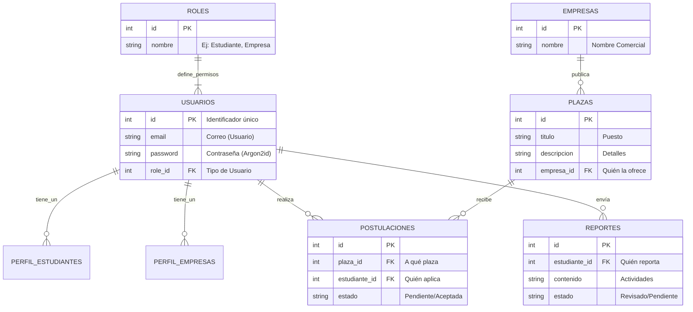

# Esquema de Base de Datos - SIGP

> **Diccionario de Datos y Modelo ER**
> **Proyecto:** Sistema Integral de Gestión de Pasantías
> **Versión:** 1.0 (Final)
> **Fecha:** Diciembre 2025

---

## Tabla de Contenidos
1.  [Introducción](#1-introducción)
2.  [Diagrama Visual](#2-diagrama-visual-entidad-relación)
3.  [Diccionario de Datos](#3-explicación-detallada-diccionario-de-datos)
    *   [Conceptos Clave](#conceptos-clave)
    *   [Tablas Principales](#tablas-principales)

---
**Fecha:** Diciembre 2025
**Versión:** 1.0

## 1. Introducción
Esta base de datos es el "cerebro" del sistema SIGP. Aquí se guarda toda la información de los usuarios (estudiantes y empresas), las ofertas de pasantía y el seguimiento de las prácticas.

Imagina la base de datos como un gran archivador digital con varias gavetas (tablas), donde cada documento (registro) está conectado con otros para mantener el orden.

## 2. Diagrama Visual (Entidad-Relación)
A continuación se muestra cómo se conectan las partes más importantes del sistema:

## 3. Explicación Detallada (Diccionario de Datos)

### Conceptos Clave
*   **PK (Primary Key / Llave Primaria)**: Es como el número de DUI de cada registro. Es un número único que identifica, por ejemplo, a un estudiante específico para no confundirlo con otro.
*   **FK (Foreign Key / Llave Foránea)**: Es un enlace o "puente". Por ejemplo, una *Postulación* tiene el ID del estudiante (FK). Esto le dice al sistema: "Esta postulación pertenece al estudiante con ID 5".

### Tablas Principales

#### 1. Usuarios (`usuarios`)
Es la tabla maestra. Aquí están registrados todos: administradores, empresas y estudiantes.
*   `id` (PK): El número único del usuario.
*   `email`: Su correo para iniciar sesión.
*   `password`: La contraseña encriptada (protegida).
*   `role_id` (FK): Indica si es Estudiante (5), Empresa (2), etc.

#### 2. Perfiles (`perfil_estudiantes` / `perfil_empresas`)
Guardan la información detallada que no cabe en la tabla de usuarios.
*   **Estudiantes**: Guarda la carrera, matrícula, habilidades y la ruta de su CV.
*   **Empresas**: Guarda el rubro, dirección, teléfono y sitio web.

#### 3. Plazas (`plazas`)
Son las ofertas de pasantía que publican las empresas.
*   `empresa_id` (FK): Conecta la plaza con la empresa que la creó.
*   `titulo`: El nombre del puesto (ej. "Programador Junior").
*   `estado`: Si está "abierta" (recibiendo gente) o "cerrada".

#### 4. Postulaciones (`postulaciones`)
Es el registro de cuando un estudiante aplica a una plaza.
*   `estudiante_id` (FK): ¿Quién aplicó?
*   `plaza_id` (FK): ¿A qué plaza?
*   `estado`: Puede ser 'pendiente', 'aceptada' o 'rechazada'.

#### 5. Reportes (`reportes`)
Documentos que suben los estudiantes para informar sobre su avance en la pasantía.
*   `tutor_id` (FK): El profesor o tutor que debe revisar este reporte.

#### 6. Bitácora (`bitacora`)
Es la "caja negra" del sistema. Registra cualquier error o acción importante (login, logout) para seguridad.
*   `accion`: Qué pasó (ej. "Login Exitoso").
*   `fecha`: Cuándo pasó.

---
**¿Dependencias?**
El sistema tiene una dependencia fuerte de la tabla `usuarios`. Si borras un usuario, el sistema (gracias a la regla `ON DELETE CASCADE`) borrará automáticamente su perfil, sus postulaciones y sus reportes para no dejar "basura" en la base de datos.
