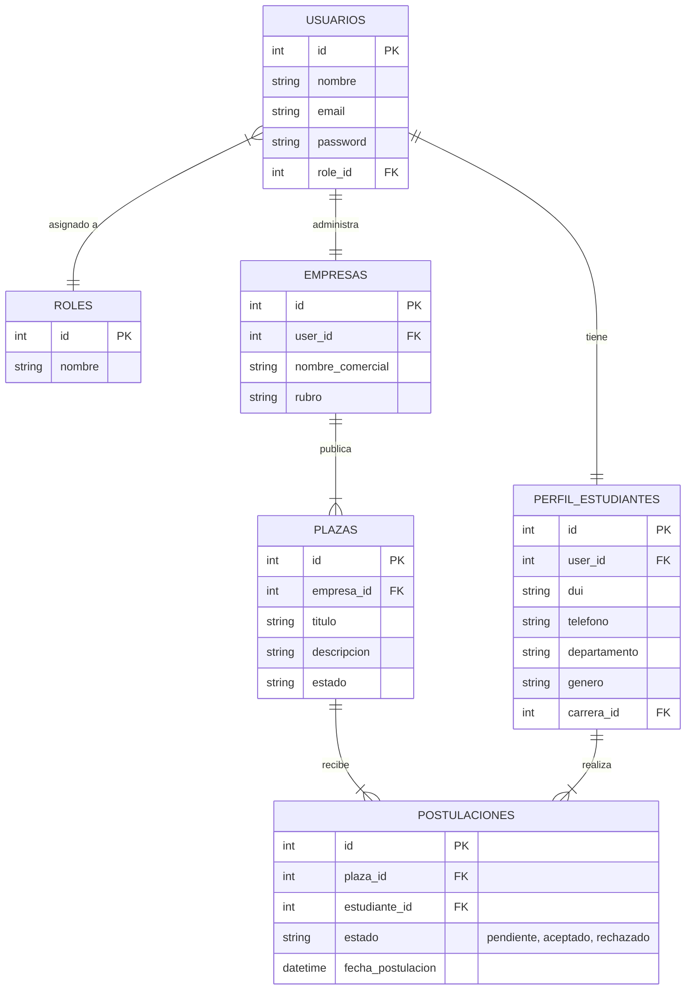

# Esquema de Base de Datos - SIGP

## Diagrama Entidad-Relación

## Relaciones Clave

1.  **Autenticación Centralizada**: La tabla `usuarios` gestiona el acceso para todos los roles, diferenciándose por `role_id`.
2.  **Perfiles Extendidos**: Dependiendo del rol, se extiende la información en `perfil_estudiantes` o `empresas`.
3.  **Ciclo de Postulación**: Relación muchos a muchos entre estudiantes y plazas a través de `postulaciones`.
